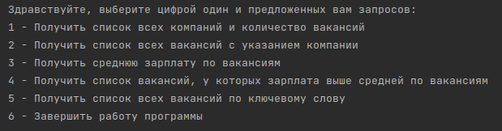

# **COURSE WORK № 4** 
Это проект, написанный на языке Python и SQL. Выполняет парсинг компаний и их вакансий с сайта HeadHunters.ru. 
Создает базу данных с таблицами и вносит полученные данные в эти таблицы. Пользователю представлены 5 вариантов 
запросов, которые он может выбрать и получить информацию о компаниях и вакансиях.

### **Установка**
Для установки проекта cw5_psql_hh, следуйте инструкциям ниже:

<p>1. Склонируйте репозиторий на своем компьютере:</p>

`git clone https://github.com/VictorVolkov7/cw5_psql_hh`

 <p>2. Перейдите в папку с проектом:</p>

`cd cw5_psql_hh`

<p>3. Создайте и активируйте виртуальное окружение:</p>

`poetry init`

`poetry shell`

<p>4. Установите зависимости проекта:</p>

`poetry install`

<p>5. Создайте файл database.ini в корневой папке проекта и заполните данные для подключения к PostgresSQL</p>

```ini
[postgresql]
host=localhost
user=postgres
password=your_password
port=5432
```

<p>6. Получение API ключа для работы с exchangerates:</p>

Зайдите на сайт https://apilayer.com пройдите регистрацию или войдите в свой аккаунт. В поиске наберите 
"Exchange Rates Data API" совершите подписку на бесплатный или платный план. Далее скопируйте ваш API ключ и
его в ваши переменные окружения, а также в конфигурацию main.py.

### **Использование**
После установки проекта cw5_psql_hh, вы можете использовать для удобного просмотра вакансий по разным запросам.




Автор
VictorVolkov7 - vectorn1212@gmail.com
